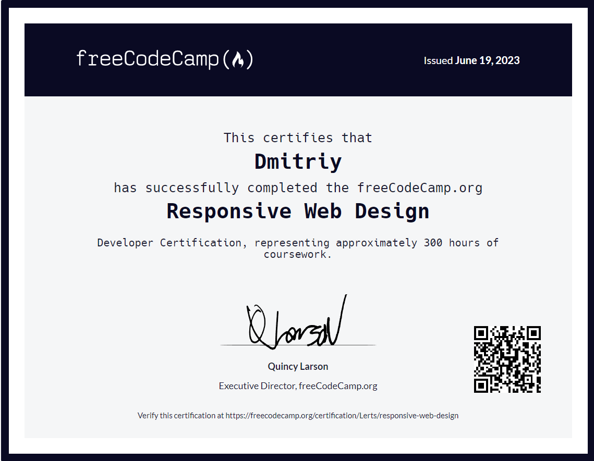

<h1 align="center">Привет, меня зовут Дмитрий
</h1>
<h3 style="text-align: center">Сейчас я ищу работу, компанию с перспективой развития навыков и карьерного роста. Я быстро осваиваю новый материал. Я готов учиться и совершенствовать свои профессиональные навыки. </h3>

<h2 dir="auto">
 Технологии и инструменты, которые я использую:</h2>

  <table>
    

      

        

        
           
          html
        

        

        
           
          CSS
        

        

          
           
          SCSS
        

        

          
           
          JavaScript
        

        

          
           
          Vue.js
        

        

          
           
          Vuex
        

        

          
           
          Axios
        

      

    

  </table>
  

## Курсы которые я прошел:

- [freeCodeCamp Responsive Web Design](https://www.freecodecamp.org/certification/Lerts/responsive-web-design)
  

<!-- Cсылка с иконками на GitHub: https://github.com/devicons/devicon/blob/master/icons/css3/css3-original-wordmark.svg?ysclid=lqall2krzd67529310 -->
